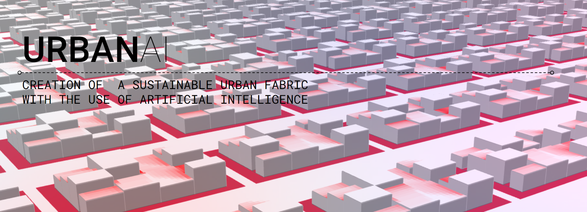

# MACAD // AIA + DIGITAL TOOLS FOR COMPUTER VISION & DATA ENCODING: URBANAI
A packaged repository for our final project called "UrbanAI", created for the Computer vision seminar at the Masters in Advanced Computation for Architecture and Design.
The repository contains all the necessary information, links and scripts necesarry to re-create the project using the selected data.

PROJECT PRESENTATION: https://docs.google.com/presentation/d/1ISsYlxu68UKSwflWaMLhoYx38GvOFVCBB_EHiALyZQw/edit?usp=sharing 

PROJECT VIDEO: https://youtu.be/2e2w7iYi_Fo

FACULTY: Gabriella Rossi + Illiana Papadopoulou

COLLABORATORS: Joao Silva + German Otto Bodenbender

-----------------------------------------

// HOW TO START

01 + Clone the repository and run the "AIA_COM_VISION_G04_URBAN_AI_PCA_ANALYSIS" on colab to perform a PCA analysis.

02 + Once the analysis is done, open and run the "AIA_COM_VISION_G04_URBAN_AI_ML_REGRESSION_MULTI_PRECITION_V05" file on colab as well to train the model.

03 + Once the model is trained, you can save the .h5 file and add it onto your local repository

04 + Open VS and select the "app.py" file. Load the saved .h5 fle onto the code.

05 + Open the provided Grasshopper file and load the provided URL from the Visual Studio terminal onto Hops.

